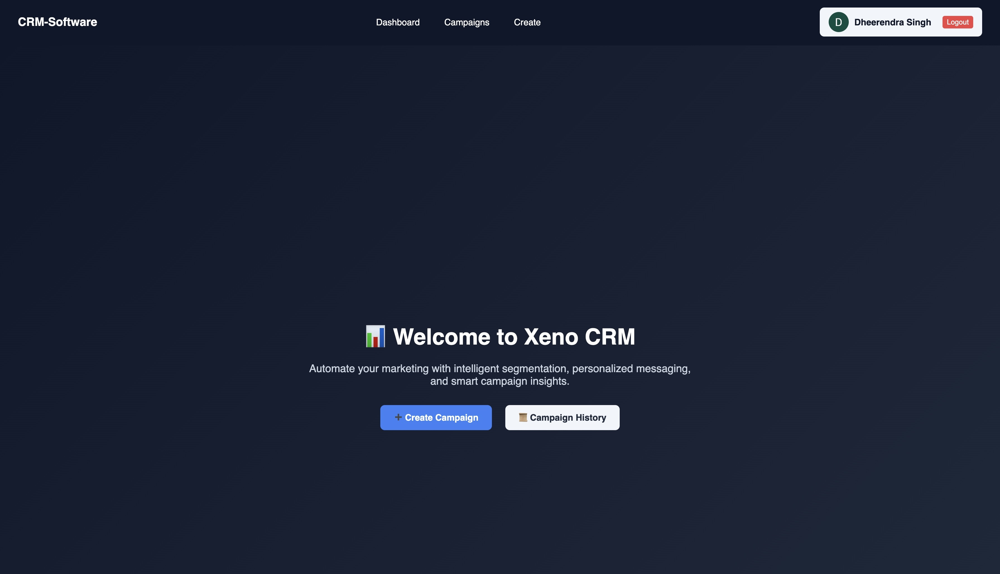

# CRM-Dashboard

A customizable campaign management dashboard that allows users to define audience segments based on specific rules. The platform intelligently converts technical rules into user-friendly, human-readable statements using AI.

## 📸 Screenshots

### 🔐 Hero Page


🌐 **Live Site**: [https://custom-manage.netlify.app/](https://custom-manage.netlify.app/)

## 🚀 Tech Stack

- **Frontend**: React.js  
- **Backend**: Node.js, Express.js  
- **Database**: MongoDB  
- **AI Integration**: TextRazor API for natural language processing of campaign rules  

## ✨ Features

- Create and manage marketing campaigns
- Define audience segmentation rules (e.g., "Total Spending > 0 AND Visits < 10")
- AI-generated human-readable rule descriptions (e.g., "Users who have spent more than 0 and visited fewer than 10 times")
- Responsive and modern UI
- Secure API endpoints and efficient data storage

## 📦 Installation

```bash
# Clone the repository
git clone https://github.com/Dheerendra69/CRM-Dashboard.git
cd CRM-Dashboard
# Install dependencies for both frontend
npm install
npm start
# Open new terminal
# Install dependencies for both backend 
cd ../server
npm install
npm run dev
```
